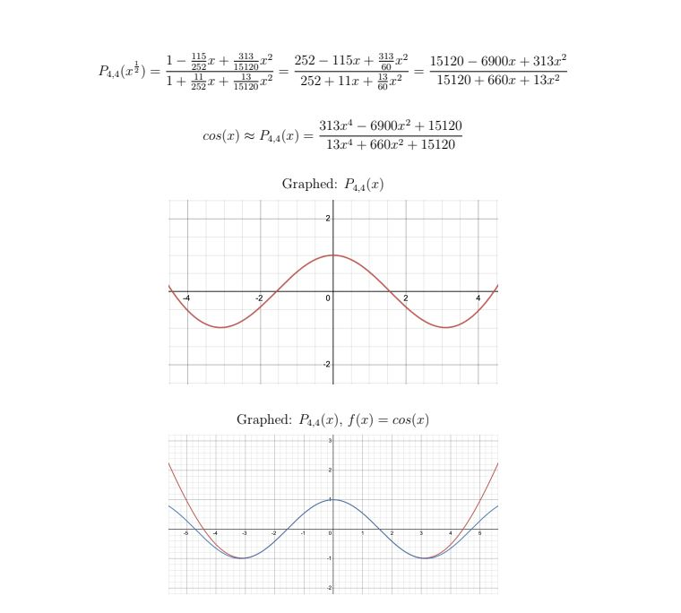

# Trigonometric-Approximation-with-Pade-Approximants

Using Pade approximants and domain shifts to calculate trigonometric functions for a given input.

More info in the research paper: 
https://drive.google.com/file/d/1nFYG8h7uOaaW8okZNh7bwgg6dE3hx-9t/view?usp=sharing
